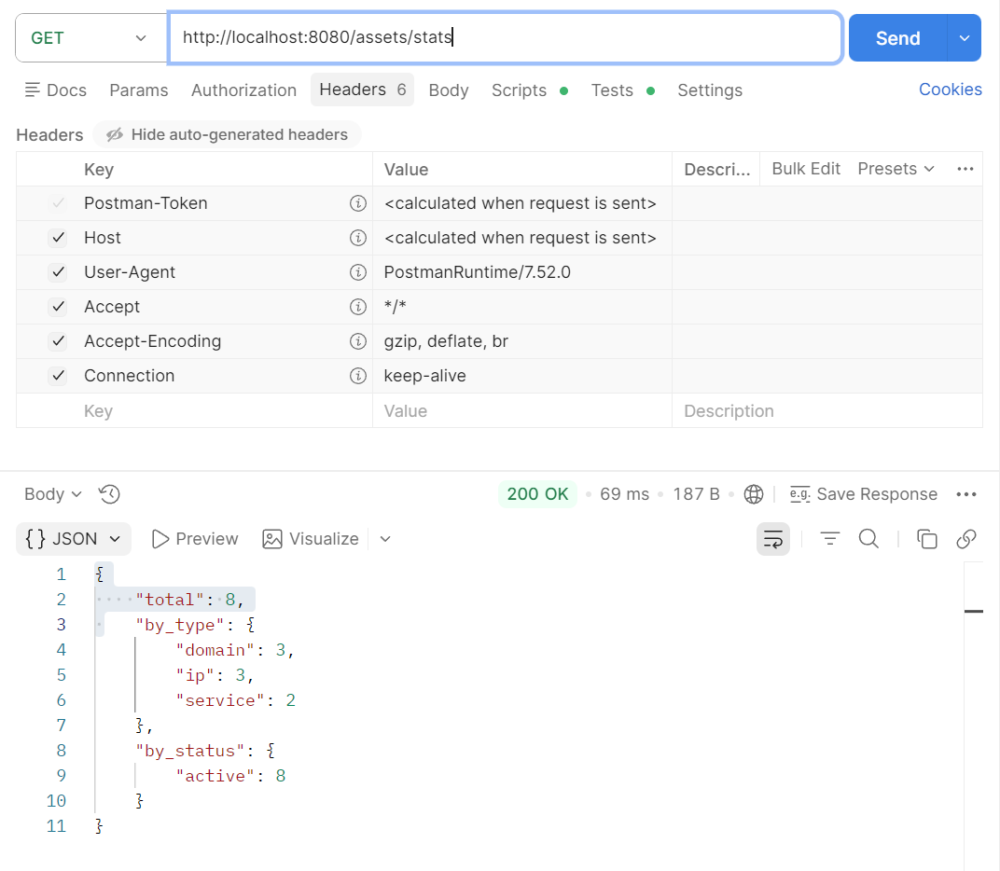
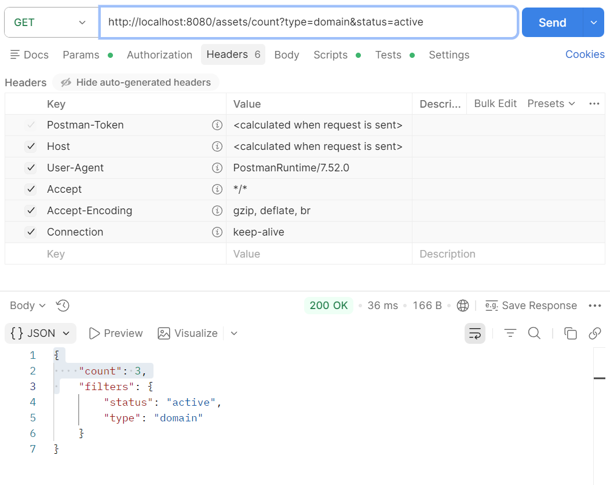
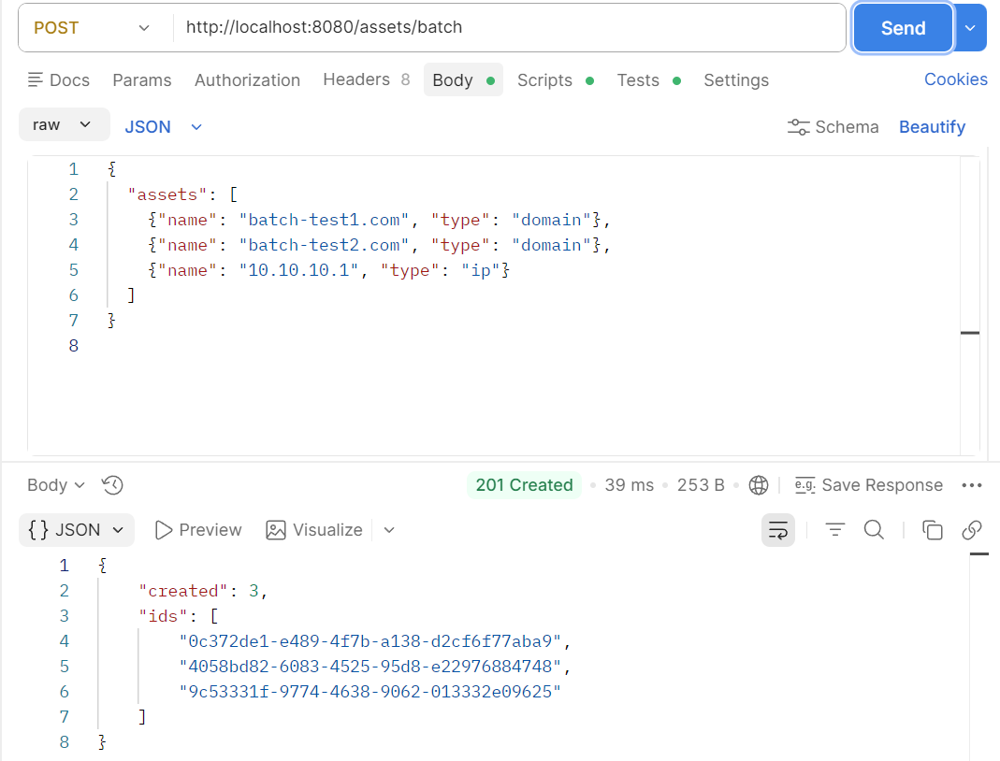
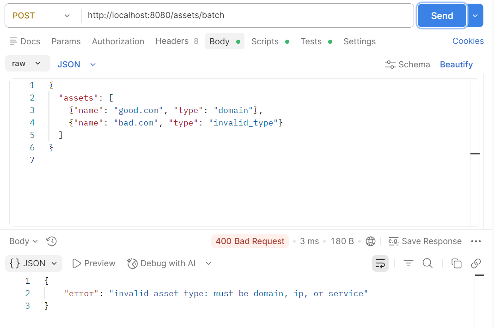
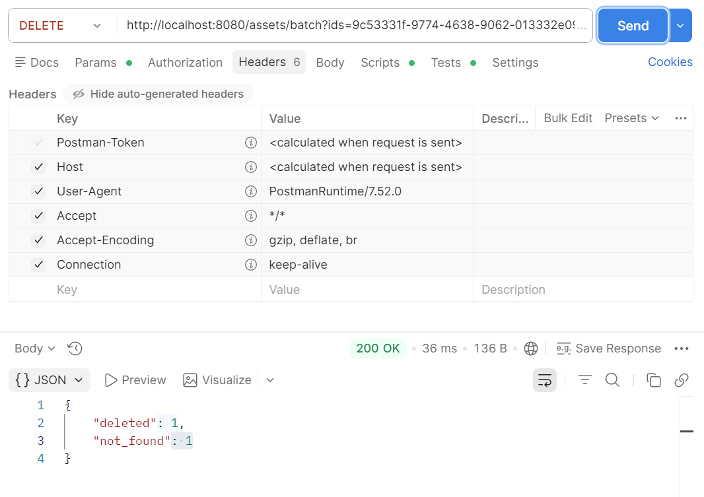
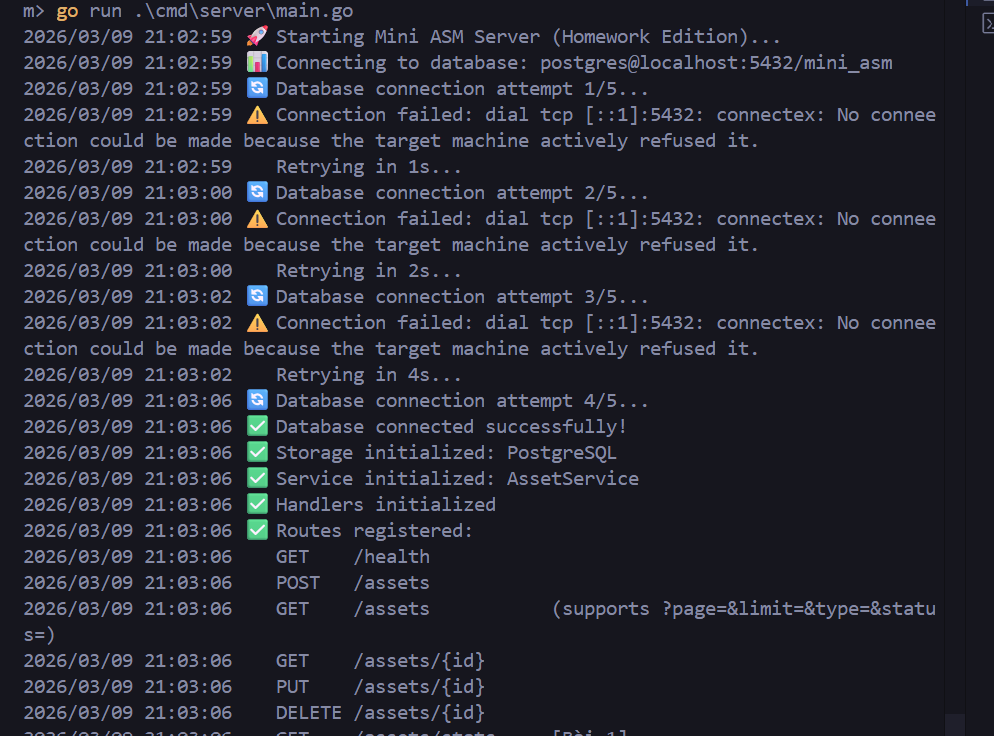
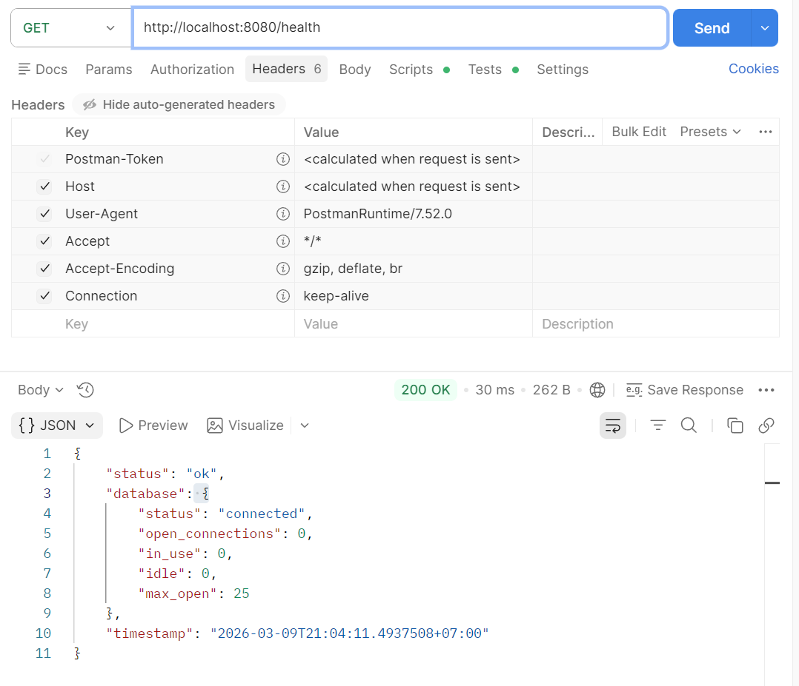
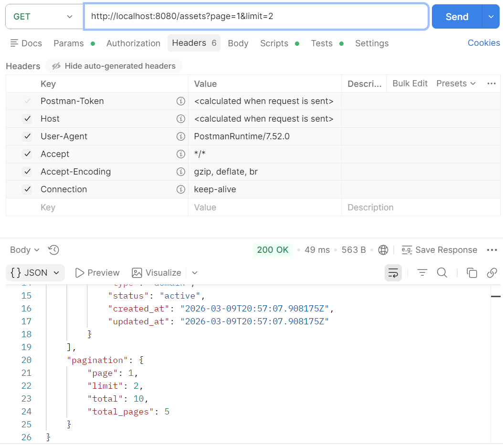
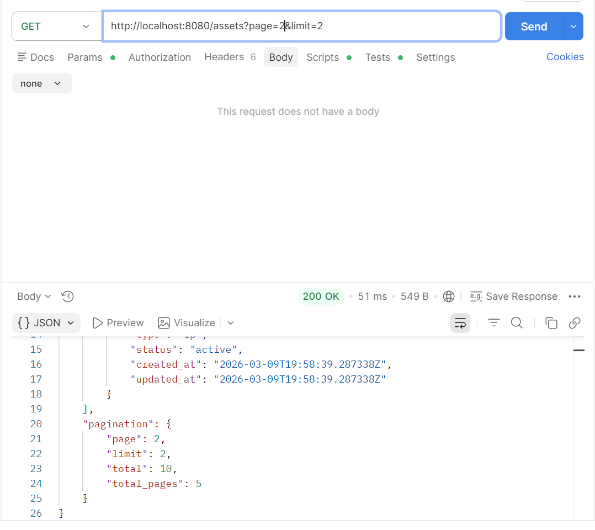
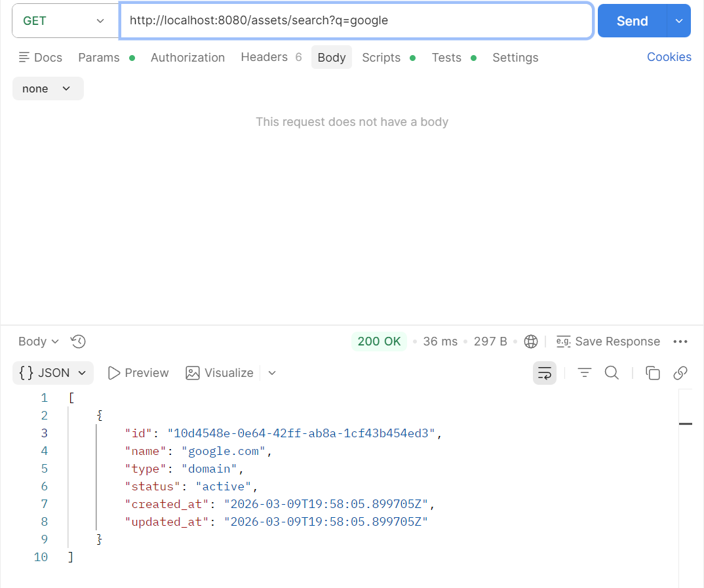

# Homework Submission

**Họ tên:** Nguyễn Nhật Minh

## Các bài đã hoàn thành

- [x] Bài 1: Statistics APIs
- [x] Bài 2: Batch Create
- [x] Bài 3: Batch Delete
- [x] Bài 4: Connection Retry
- [x] Bài 5: Health Check
- [x] Bài 6: Pagination
- [x] Bài 7: Search

## Hướng dẫn chạy project

```powershell
# 1. Khởi động Docker Desktop

# 2. Chạy PostgreSQL
cd homeworks/Day2/mini-asm
docker-compose up -d

# 3. Chạy server
go run cmd/server/main.go
```

---

## Bài 1: Statistics APIs

### GET /assets/stats


### GET /assets/count?type=domain&status=active


---

## Bài 2: Batch Create

### POST /assets/batch (Success - 201 Created)


### POST /assets/batch (Error - 400 Rollback)


---

## Bài 3: Batch Delete

### DELETE /assets/batch?ids=...


---

## Bài 4: Connection Retry

### Server logs khi DB tắt → retry → DB bật lại → connected


---

## Bài 5: Health Check

### GET /health (DB connected - 200 OK)


---

## Bài 6: Pagination

### GET /assets?page=1&limit=2


### GET /assets?page=2&limit=2


---

## Bài 7: Search

### GET /assets/search?q=.com


### GET /assets/search?q=google

